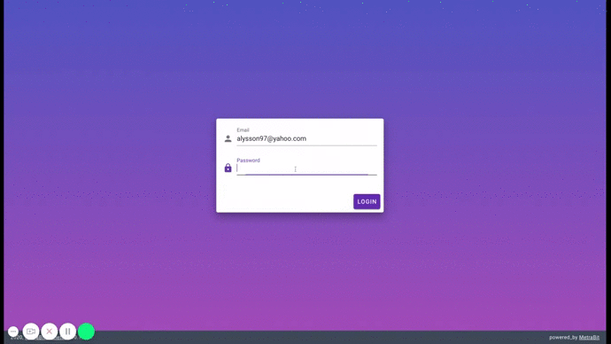

# Vue.js client skeleton

MetraBit Vue.js client skeleton. Project includes base auth system with API on Symfony 5 (API platform) based on JWT tokens.



### Project setup
Rename **.env.dist** to **.env**, change API host parameter inside. Then execute following commands:
```
$ yarn install
$ yarn serve
```
